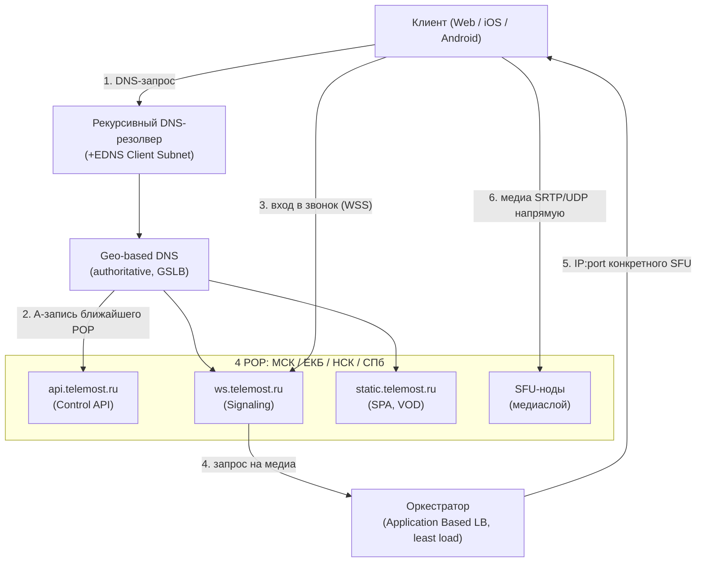
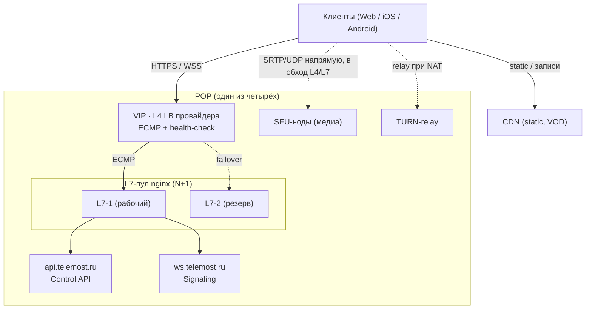
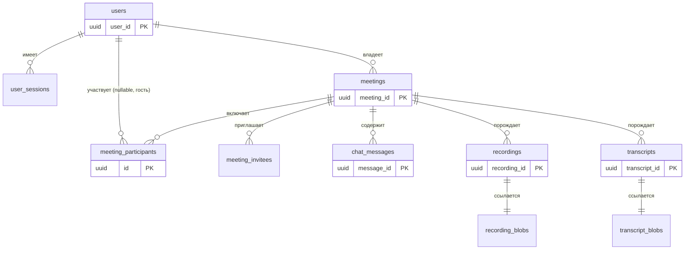
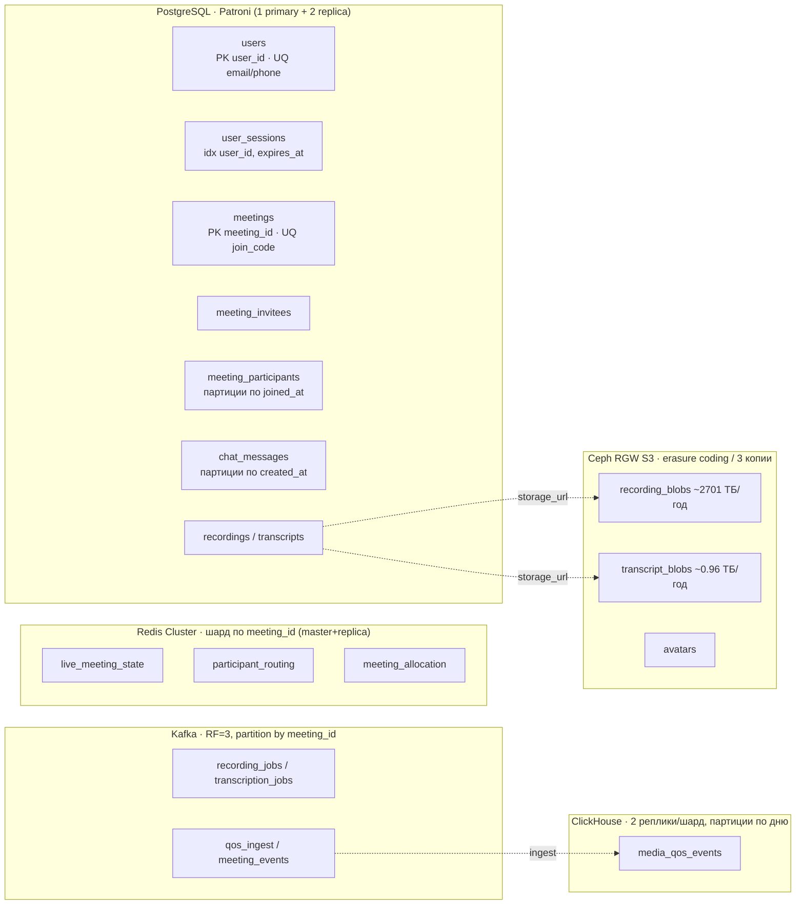
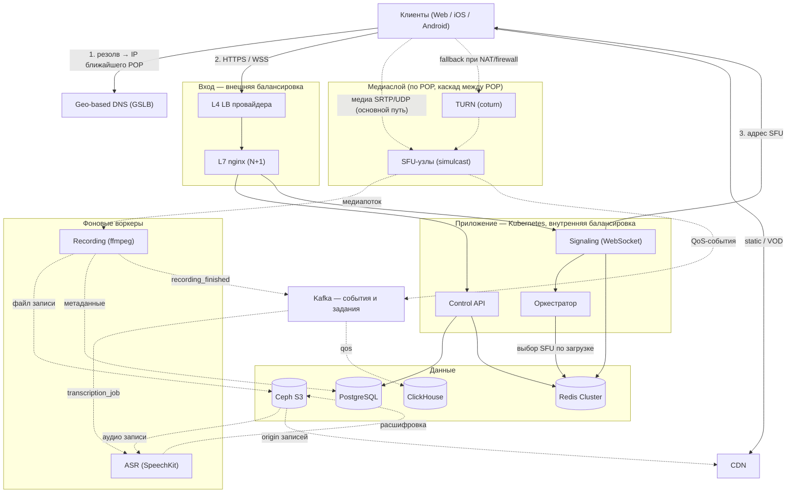

# Расчётно-пояснительная записка сервиса видеовстреч

## Описание и аналоги

### Описание

Яндекс.Телемост — сервис видеовстреч, ориентированный на личное и корпоративное использование. Сервис позволяет быстро организовать встречу по ссылке, подключать участников с разных устройств, а также проводить крупные мероприятия (вебинары/общие созвоны) с большим числом подключений. [2](#список-источников)

### Существующие аналоги

На рынке существуют следующие аналоги:

- Zoom
- Google Meet
- Microsoft Teams
- VK Звонки

## Аудитория

### Описание аудитории

Основная аудитория — пользователи Российской Федерации в возрасте от 12 до 55 лет. [3](#список-источников)

Целевая аудитория Телемоста — пользователи в России, которым нужны регулярные видеовстречи: команды (с распределёнными офисами), малый и средний бизнес, образование (вебинары), а также частные пользователи для групповых звонков. Для корпоративного сегмента важны управляемость, безопасность и возможность работы в закрытом контуре организации. [3](#список-источников)

### Местоположение аудитории

Большая часть пользователей находится на территории Российской Федерации [3](#список-источников)

### Размер аудитории

В качестве базовой оценки принимаем аудиторию Телемоста в размере 5 млн пользователей. [5](#список-источников)

## Функциональные требования

### Основной функционал

Функционал сервиса включает: [2](#список-источников)

- Создание видеовстречи и подключение по ссылке
- Планирование встречи через календарь
- Подключение с веб-клиента и мобильных устройств
- Управление участниками (включение/выключение микрофона, удаление)
- Демонстрация экрана
- Чат внутри встречи
- Возможность записи встречи

### Ключевые продуктовые решения

- Гостевой режим: подключение возможно без входа в аккаунт/регистрации [2](#список-источников)
- Поддержка крупных встреч (до 1000 участников)
- Расшифровка встречи

# Расчёт нагрузки

## Базовые параметры

Все дальнейшие расчёты основаны на следующих исходных значениях:

| Параметр                                       | Значение         | Источник                                           |
| ---------------------------------------------- |------------------| -------------------------------------------------- |
| MAU                                            | 5.15 млн         | Mediascope, октябрь 2025 [[5](#список-источников)] |
| DAU                                            | 1 млн            | Пресс-релиз Яндекса [[4](#список-источников)]      |
| Среднее время в звонках на пользователя в день | 1 час            | AdIndex [[6](#список-источников)]                  |
| Длительность типовой встречи                   | 45 мин           | Zoom Blog [[7](#список-источников)]                |
| Среднее кол-во участников встречи              | 5                | Zoom Blog [[14](#список-источников)]               |
| Доля записываемых встреч                       | 5 %              | [[13](#список-источников)]                         |
| Разрешение записи                              | 720p (HD)        | Zoom Support [[15](#список-источников)]            |
| Битрейт записи (видео + аудио)                 | 1.60 Мбит/с      | Zoom Developer Forum [[17](#список-источников)] |
| Разрешение встречи          | 720p (HD)        | Zoom Technical Library [[16](#список-источников)]  |
| Битрейт live: uplink / downlink                | 2.6 / 1.8 Мбит/с | Zoom Technical Library [[16](#список-источников)]  |
| Аудио VoIP                                     | 60–80 Кбит/с     | Zoom Technical Library [[16](#список-источников)]  |

### MAU и DAU

MAU берём как месячную аудиторию сервиса в РФ (уникальные пользователи за месяц): 5.15 млн в октябре 2025 по данным Mediascope [[5](#список-источников)].

DAU исходя из открытых источников составляет 1 млн [[4](#список-источников)].

$$  
DAU = 1  
$$

### Средний размер хранилища пользователя

Необходимо хранение:

- истории звонков/встреч за последние 90 дней [[2](#список-источников)];
- сообщений чата внутри встреч;
- служебных настроек/устройств/сессий;
- для части встреч — расшифровок/конспектов [[7](#список-источников)].

Из исследования по РФ возьмём ориентир: в среднем сотрудники тратят на онлайн-встречи около 1 часа в день [[6](#список-источников)].  
Длительность типовой встречи примем 45 минут (0.75 часа) [[7](#список-источников)].

Число встреч на пользователя в день:

$$  
N_{day}=\frac{1}{0.75}\approx 1.33  
$$

Так как основной сценарий — рабочие дни, пересчитаем 90 календарных дней в рабочие:

$$  
N_{90} = 90 \cdot \frac{5}{7} \cdot 1.33 \approx 86  
$$

Допущения по записям в БД на пользователя:

- записи участия во встречах: ~86 строк;
- сообщения чата: в среднем 4 сообщения на встречу ⇒ $86 \cdot 4 \approx 344$ строк;
- настройки/устройства/сессии: ~20 строк;
- расшифровки/конспекты: для 10% встреч (в среднем по аудитории) ⇒ ~9 строк метаданных.

Итого:

$$  
SRH_{rows} \approx 86 + 344 + 20 + 9 \approx 459 \approx 500  
$$

Средний размер строки примем 256 байт (идентификаторы, таймкоды, короткие поля, текстовые фрагменты чата).

$$  
SRH_{bytes}=500 \cdot 256 = 128000
$$

В гигабайтах:

$$  
SRH_{GB}\approx 1.1 \cdot 10^{-4}  
$$

---

## Технические метрики

### Размер хранения

Разделим хранение на:

1. пользовательские метаданные (история, чат, настройки);
2. записи встреч (видеозаписи);
3. расшифровки/конспекты.

**1) Пользовательские метаданные**

$$  
V_{users} = MAU \cdot 120\text{ КБ} \approx 5.15\cdot 10^6 \cdot 120\text{ КБ} \approx 0.63\text{ ТБ}  
$$

**2) Записи встреч (объектное хранилище, HD 720p, без удаления)**

Оценим число уникальных сессий встреч в сутки.

Звонков в сутки (1 час на активного пользователя [[6](#список-источников)]):

$$  
H_{\text{person/day}} = DAU \cdot 1\text{ час} \approx 1.03\cdot 10^6 \text{ час/день}  
$$

При среднем размере встречи 5 участников [[14](#список-источников)] число часов встреч (уникальных сессий) в сутки:

$$  
H_{\text{session/day}} = \frac{H_{\text{person/day}}}{5} \approx 206000 \text{ час/день}  
$$

Доля записываемых встреч $p_{rec}=0.05$:

$$  
H_{\text{rec/day}}=H_{\text{session/day}}\cdot 0.05 \approx 10300 \text{ час/день}  
$$

Для размера записи используем **HD (720p)** — стандартное разрешение облачных записей видеоконференций. Согласно официальной документации Zoom, облачные записи сохраняются с максимальным разрешением 1280 × 720p для большинства сценариев [[15](#список-источников)].  
Битрейт *файла* записи **1.60 Мбит/с** [[17](#список-источников)]. Используем это значение:

$$  
B_{\text{rec}}=1.60\text{ Мбит/с}  
$$

Размер 1 часа записи:

$$  
S_{1h}=\frac{B_{\text{rec}}\cdot 3600}{8}  
=\frac{1.60\cdot 3600}{8}\approx 720\text{ МБ/час}\approx 0.72\text{ ГБ/час}  
$$

Объём новых записей в сутки:

$$  
S_{\text{rec/day}}=H_{\text{rec/day}}\cdot S_{1h}  
\approx 10300\cdot 0.72 \approx 7416\text{ ГБ/день}\approx 7.4\text{ ТБ/день}  
$$

$$  
S_{\text{rec}}(D)=S_{\text{rec/day}}\cdot D  
$$

Для оценки возьмём 1 год:

$$  
S_{\text{rec/year}}\approx 7.4\cdot 365 \approx 2701\text{ ТБ}  
$$

Оценка количества файлов записей (если средняя встреча 45 минут [[7](#список-источников)] = 0.75 часа):  

$$  
N_{\text{meet/day}}=\frac{H_{\text{session/day}}}{0.75}\approx 274667 \text{ встреч/день}  
$$

$$  
N_{\text{rec-files/day}}=N_{\text{meet/day}}\cdot 0.05 \approx 13733 \text{ файлов/день}  
$$

$$  
N_{\text{rec-files/year}}\approx 13733\cdot 365 \approx 5.01\cdot 10^6 \text{ файлов}  
$$

**3) Расшифровки/конспекты**

10% встреч имеют сохранённую расшифровку/конспект.  
Для русскоязычной аудитории средний размер текста 45-минутной встречи оценивается в ~79 КБ  
(с учётом средней скорости речи ~150 слов/мин, длины слова ~6 символов и кодировки UTF-8(2 байт/символ)).

$$  
S_{\text{tr/day}}\approx 0.1\cdot N_{\text{meet/day}}\cdot 79\text{ КБ}  
$$

Подставляем:

$$  
S_{\text{tr/day}}\approx 0.1\cdot 274667\cdot 79\text{ КБ}  
\approx 2746670\text{ КБ}  
\approx 2.62\text{ ГБ/день}  
$$

За год (накопление без удаления):

$$  
S_{\text{tr/year}}\approx 2.62\cdot 365  
\approx 956\text{ ГБ}  
\approx 0.96\text{ ТБ}  
$$

Итого:

| Объект хранения             | Размер, шт (оценка)    | Размер, Тб |
| --------------------------- | ---------------------- | ---------- |
| Пользовательские метаданные | 5.15 млн пользователей | 0.63       |
| Записи встреч               | ~5.01 млн файлов       | 2701       |
| Расшифровки/конспекты       | ~10.0 млн документов   | 0.96       |

### Сетевой трафик

Для оценки трафика возьмём **HD (720p)**. Согласно официальной документации Zoom, 720p является стандартным для групповых встреч[[16](#список-источников)]:

- видео: **uplink 2.6 Мбит/с**, **downlink 1.8 Мбит/с**,
- аудио VoIP: **60–80 Кбит/с** в обе стороны [[16](#список-источников)].

Если аудио 0.08 Мбит/с, то итоговые значения:

- аплинк одного участника: $B_{\text{up}} = 2.6 + 0.08 = 2.68$ Мбит/с,
- даунлинк одного участника: $B_{\text{down}} = 1.8 + 0.08 = 1.88$ Мбит/с.

Среднее число одновременных участников (средняя одновременная нагрузка за сутки), если активный пользователь в среднем в звонках 1 час в день:

$$  
CCU_{\text{avg}}=\frac{DAU \cdot 1}{24}\approx \frac{1\cdot 10^6}{24}\approx 42917  
$$

Суммарная средняя пропускная способность (вход + выход):

$$  
Q_{\text{avg}}=\frac{CCU_{\text{avg}}(B_{\text{up}}+B_{\text{down}})}{1000}  
=\frac{42917(2.68+1.88)}{1000}\approx 195.7 \text{ Гбит/с}  
$$

Для пикового значения возьмём коэффициент 3:

$$  
Q_{\text{peak}}=195.7 \cdot 3 \approx 587.1 \text{ Гбит/с}  
$$

Суточный объём трафика, с переводом из Гбит в ГБ:

$$  
V_{\text{day}}=\frac{Q_{\text{avg}} \cdot 86400}{8}\approx \frac{195.7 \cdot 86400}{8}\approx 2113560 \text{ ГБ/сутки}  
$$

| Стандартная нагрузка, Гбит/с | Пиковая нагрузка, Гбит/с | Суточный, Гб |
| ---------------------------- | ------------------------ | ------------ |
| 195.7                        | 587.1                    | 2113560      |

### RPC

Используем:

$$  
CCU_{\text{avg}}\approx 42917,\qquad  
CCU_{\text{peak}}=CCU_{\text{avg}}\cdot 3 \approx 128751  
$$

Выделим основные типы запросов:

1. **Auth/Join** — вход во встречу
2. **Heartbeat** — проверка соединения
3. **Chat API** — отправка/получение сообщений
4. **Meeting control** — mute/unmute, включение камеры, роли, реакции

---

- **Heartbeat:**  
  $r_{hb} = 0.03$ RPS на участника:

$$  
r_{hb} = 0.03 \text{ RPS}  
$$

- **Chat API:**  
  Активность чата ~0.3–0.5 сообщений в минуту среди активных; активных пишущих ~15–20%. 20% участников × 0.4 msg/мин:

$$  
r_{chat} = 0.2 \cdot \frac{0.4}{60} \approx 0.00133 \text{ RPS}  
$$

- **Meeting control:**  
  Действия: mute/unmute, камера, поднятие руки, реакции, шаринг экрана. В среднем 0.5–1 действие за 2 минуты на участника;

$$  
r_{control} = \frac{0.75}{120} = 0.00625 \text{ RPS}  
$$

- **Auth/Join (вход во встречу):**  
  При $DAU = 1$ млн и $N_{day} \approx 1.33$ встречи на пользователя в сутки число входов в день:

$$  
J_{day} = DAU \cdot N_{day} = 1{,}000{,}000 \cdot 2.66 = 2{,}660{,}000 \text{ входов/сутки}  
$$

$$  
RPS_{auth,avg} = \frac{J_{day}}{86400} \approx 30.8 \approx 30 \text{ RPS}  
$$

---

### Средний RPS по типам

$$  
RPS_{\text{type,avg}} = CCU_{\text{avg}} \cdot r_{\text{type}}  
$$

Пиковый RPS: для оценки используем ×3.

$$  
RPS_{\text{type,peak}} = RPS_{\text{type,avg}} \cdot 3  
$$

---

### Сводная таблица RPS (средний / пиковый ×3)

| Тип запросов        | rps/участник (эфф.) | RPS avg | RPS peak (×3) |
| ------------------- | --------------------|--------|---------------|
| Heartbeat/Keepalive | 0.03                 | 1287   | 3861          |
| Chat API            | 0.00133             | 57     | 171           |
| Meeting control     | 0.00625             | 268    | 804           |
| Auth/Join           | —                   | 30     | 90            |
| **Итого**           | —                   | **1627** | **4881**    |

---

## Итоговые значения

| Метрика                                    | Среднее      | Пиковое     |
| ------------------------------------------ | ------------ | ------------ |
| **Аудитория**                              |              |              |
| MAU                                        | 5.15 млн     | —            |
| DAU                                        | 1 млн        | —            |
| Среднее кол-во одновременных пользователей | 42 917       | 128 751      |
| **Хранение (за год)**                      |              |              |
| Метаданные пользователей                   | 0.63 ТБ      | —            |
| Записи встреч                              | 2 701 ТБ     | —            |
| Расшифровки/конспекты                      | 0.96 ТБ      | —            |
| **Сетевой трафик**                         |              |              |
| Пропускная способность                     | 195.7 Гбит/с | 587.1 Гбит/с |
| Суточный объём                             | 2 113 560 ГБ | —            |
| **RPS**                                    |              |              |
| Итого RPS                                  | 1 627        | 4 881 (×3)   |

---

# Глобальная балансировка нагрузки (GSLB)

## Объяснение терминов

| Термин | Значение |
|--------|----------|
| POP (Point of Presence) | Площадка с серверами рядом с пользователем. У сервиса их четыре: Москва, Екатеринбург, Новосибирск, Санкт-Петербург. |
| Media / Control / Signaling | Три слоя видеосервиса с разным профилем нагрузки: медиа (RTP, сотни Гбит/с, чувствительно к задержке), управление (REST, низкий RPS), сигналинг (WebSocket, вход в звонок и контроль). |
| SFU (Selective Forwarding Unit) | Медиасервер, принимающий RTP-потоки участников и выборочно пересылающий их остальным без транскодирования (в отличие от MCU) [[26]](#список-источников). |
| Geo-based DNS | DNS с геомаршрутизацией: резолвер определяет регион клиента и возвращает A-запись ближайшего POP [[27]](#список-источников). |
| EDNS Client Subnet (ECS) | Расширение DNS, передающее подсеть конечного клиента в запросе. Компенсирует то, что authoritative DNS видит IP резолвера, а не клиента [[27]](#список-источников). |
| Application Based Load Balancing | Балансировка на уровне приложения: сервис сам выдаёт клиенту прямой адрес нужного сервера. При хорошей реализации это одно из самых эффективных решений [[28]](#список-источников). Так у нас балансируется медиа. |
| Anycast | Один IP объявляется из нескольких точек через BGP, трафик идёт на топологически ближайший узел. Требует собственного AS-номера и сети /24 [[28]](#список-источников). |
| Failover | Переключение на резервный POP при отказе основного. Скорость ограничена DNS TTL, обычно 20–60 секунд. |

## Функциональное разбиение по доменам

| Контур | Домен / механизм | Назначение | Транспорт |
|--------|------------------|-----------|-----------|
| Control API | `api.telemost.ru` | auth, создание и планирование встреч, история, метаданные | HTTPS |
| Signaling | `ws.telemost.ru` | вход во встречу, SDP/ICE, roster, чат, mute/hand/реакции | WSS |
| Media (SFU) | Application Based LB, не DNS | приём и пересылка RTP-потоков | SRTP/DTLS / UDP |
| NAT traversal | `turn.telemost.ru` | STUN-обнаружение, TURN-relay при симметричном NAT | UDP/TCP/TLS |
| Статика и записи | `static.telemost.ru` → CDN | веб-клиент (SPA), VOD-записи встреч | HTTPS (CDN) |

Контуры разнесены по доменам, чтобы масштабировать их независимо и держать отдельные TLS- и upstream-политики. Записи встреч (VOD) к задержке нечувствительны и раздаются обычным CDN, в отличие от live-медиа.

> **Почему медиа не в DNS:** медиапоток не маршрутизируется доменом. ICE требует конкретный `IP:port` SFU-нода, а выбор узла зависит от его текущей загрузки и от того, на каком POP «прописана» встреча. Это решает оркестратор (Application Based LB), а не DNS-резолвер.

## Расположение дата-центров

Media plane размещается в 4 edge-POP близко к пользователям. Control plane и первичная БД централизованы: primary в МСК, DR в СПб.

| POP | Покрываемые округа | Население, млн | Доля | Назначение |
|-----|--------------------|:--------------:|:----:|-----------|
| МСК | ЦФО + ЮФО + СКФО | 40.2 + 16.6 + 10.2 = 67.1 | 46 % | media + Control/БД primary |
| ЕКБ | ПФО + УФО | 28.7 + 12.3 = 40.9 | 28 % | media edge |
| НСК | СФО + ДВФО | 16.6 + 7.9 = 24.5 | 17 % | media edge |
| СПб | СЗФО | 13.9 | 9 % | media edge + Control/БД DR |
| Итого | | 146.4 | 100 % | |

> **Почему 4 POP, а не один ДЦ:** для интерактивного видео критична задержка. По ITU-T G.114 односторонняя задержка до 150 мс обеспечивает «прозрачную интерактивность», диапазон 150–400 мс приемлем с оговорками, а свыше 400 мс недопустим [[24]](#список-источников). Россия охватывает 11 часовых поясов, и RTT по магистралям восток↔запад доходит до сотни миллисекунд (для сравнения, у Jeff Dean трансконтинентальный round-trip около 150 мс). При единственном ДЦ в Москве восточные пользователи попадают в зону деградации: перебивания речи, эхо, рост буферизации, а за этим отток с групповых звонков. Распределённые POP снижают RTT до ближайшего узла до 10–40 мс.

Доли привязаны к численности населения федеральных округов по Росстату, всего около 146.2 млн [[23]](#список-источников). Москва обслуживает центр и юг, поскольку отдельной южной площадки нет и ЮФО с СКФО маршрутизируются на неё. Екатеринбург закрывает Поволжье и Урал, Новосибирск отвечает за Сибирь и Дальний Восток, Санкт-Петербург за Северо-Запад. Primary-узел в Москве выбран как крупнейшая точка обмена интернет-трафиком в РФ (MSK-IX) [[25]](#список-источников), что даёт лучшую связность с провайдерами и минимальную сетевую задержку для слоя управления.

## Распределение нагрузки по ДЦ

Пиковые значения из раздела «Расчёт нагрузки» (CCU 128 751, медиа 587.1 Гбит/с) распределены по долям аудитории:

| POP | Доля | Пик CCU | Пик медиатрафика, Гбит/с | Источник долей |
|-----|:----:|:-------:|:------------------------:|----------------|
| МСК | 46 % | 59 225 | 270.1 | [[23]](#список-источников), ЦФО+ЮФО+СКФО |
| ЕКБ | 28 % | 36 050 | 164.4 | [[23]](#список-источников), ПФО+УФО |
| НСК | 17 % | 21 888 | 99.8 | [[23]](#список-источников), СФО+ДВФО |
| СПб | 9 % | 11 588 | 52.8 | [[23]](#список-источников), СЗФО |
| Итого | 100 % | 128 751 | 587.1 | |

Эти значения идут на вход в расчёт количества серверов SFU и TURN по каждому POP в разделах локальной балансировки и списка серверов.

## Схема DNS-балансировки

Вход (`api`, `ws`, `static`) балансируется Geo-based DNS в ближайший здоровый POP. TTL ставим 60 секунд, health-check каждые 15 секунд (TCP плюс `GET /health`). Медиапоток через DNS не проходит: сигнальный сервис запрашивает у оркестратора конкретный SFU-нод, и SRTP/UDP идёт напрямую между клиентом и SFU.

> **Нюанс с резолвером:** Geo-based DNS видит IP рекурсивного резолвера, а не конечного клиента, поэтому пользователь публичного резолвера (8.8.8.8) может попасть в неоптимальный POP. Проблему смягчает расширение EDNS Client Subnet [[27]](#список-источников). Даже если вход всё же ушёл не в тот POP, оркестратор аллоцирует медиа по фактической близости и нагрузке.

## Схема Anycast-балансировки

Anycast не используется: при перескоке трафика между ДЦ он рвёт соединения, а для видеозвонка это обрыв медиасессии (закрепление долгоживущего UDP-потока за одним узлом не гарантируется), что для real-time неприемлемо. Его роль закрывают Geo-based DNS на входе и Application Based allocation для медиа, которая выбирает узел по реальной загрузке (least load) и не рвёт сессии.

## Механизм регулировки трафика между ДЦ

1. **Allocation (Application Based LB).** При входе сигнальный сервис обращается к оркестратору, и тот по алгоритму least load назначает участнику наименее загруженный SFU-нод ближайшего POP. Встреча «прописывается» (homed) на POP инициатора или большинства участников.
2. **Каскадирование SFU.** Участники из других регионов подключаются к своему edge-POP. Межрегиональные потоки идут одним каскадным соединением между SFU вместо N прямых, что снижает межрегиональный трафик и держит задержку локальной.
3. **Перелив при перегрузке.** Когда POP близок к ёмкости, оркестратор аллоцирует новые встречи на соседний POP, осознанно допуская рост задержки. Решение принимается по тому же least load с учётом ёмкости и здоровья узлов.
4. **Failover POP.** При отказе POP его встречи переаллоцируются на соседний, клиенты переподключаются по ICE-restart. Geo-based DNS уводит входной трафик (`api`, `ws`) не позднее чем за 60 секунд (TTL).

---

# Локальная балансировка нагрузки (LSLB)

Раздел описывает балансировку внутри одного POP (Local Scale Load Balancing). Распределение между POP рассмотрено в предыдущем разделе.

## Объяснение терминов

| Термин | Значение |
|--------|----------|
| L4 / L7 балансировщик | L4 распределяет TCP-потоки (не читает содержимое), L7 разбирает HTTP/WebSocket и маршрутизирует по домену и заголовкам. |
| VIP (Virtual IP) | Плавающий IP перед пулом, точка входа в POP. Предоставляется провайдером на уровне L4. |
| TLS termination | Расшифровка HTTPS на L7. Нагружает CPU, поэтому выносится с L4 на L7. |
| SSL Session Tickets | Возобновление TLS-сессии без полного рукопожатия (RFC 5077), снижает CPU при повторных подключениях. |
| STUN / TURN | Механизмы обхода NAT — трансляции сетевых адресов, из-за которой клиент за домашним роутером не имеет прямого внешнего IP (понятие NAT разбиралось в лекции по сетям [[43]](#список-источников)). STUN сообщает клиенту его внешний адрес, TURN ретранслирует медиа через себя, когда прямое UDP-соединение с SFU не проходит (симметричный NAT, firewall). |
| Sticky WebSocket | Все пакеты одного WS-соединения идут на один бэкенд (`hash` по адресу клиента), потому что соединение живёт часами. |

## Схема балансировки и резервирование

Внутри POP два слоя балансировки для входных контуров (`api`, `ws`, `static`). Медиа и TURN через эти слои не проходят.

1. **L4-слой.** VIP провайдера принимает TCP и раздаёт его по L7-узлам (ECMP). Health-check исключает упавшие L7.
2. **L7-слой.** Пул nginx: TLS termination, маршрутизация по доменам, sticky-routing для WebSocket.

Резервирование по схеме **N+1** (`N_total = N_work + 1`): N узлов держат нагрузку, один горячий резерв принимает её при отказе любого. Схема N×2 даёт больший запас, но для нашей нагрузки на L7 избыточна.

> **Почему медиа идёт в обход L4/L7:** через балансировщики идёт только сигналинг и REST. Медиапоток (587.1 Гбит/с в пике) течёт напрямую клиент↔SFU по UDP, а SFU выбирает оркестратор (см. предыдущий раздел). Прогонять такой объём через L7 нецелесообразно, плюс TLS termination к UDP-медиа неприменим. Поэтому пропускная способность сети не является лимитером L7, она приходится на SFU и TURN.

## Расчёт количества L7-балансировщиков

Производительность одного nginx (24 CPU): **10 274 HTTPS CPS** [[29]](#список-источников) и **8.80 Гбит/с** [[30]](#список-источников). Доля новых TLS-соединений от RPS принята `k_conn = 0.2` [[31]](#список-источников), то есть `CPS_peak = 0.2 · RPS_peak`.

Лимитеры для каждого POP:
- **N_ssl** = ⌈CPS_peak / 10 274⌉;
- **N_net** = ⌈BW_peak / 8.80⌉, где BW сигналинга и REST мал (десятки Мбит/с, медиа сюда не входит);
- дополнительно проверяем число одновременных WebSocket на узел.

| POP | Пик RPS (api+ws) | Пик WS-соединений | CPS_peak | N_ssl | N_net | N_work | +1 | Итого |
|-----|:----------------:|:-----------------:|:--------:|:-----:|:-----:|:------:|:--:|:-----:|
| МСК | 2 245 | 59 225 | 449 | 1 | 1 | 1 | 1 | 2 |
| ЕКБ | 1 367 | 36 050 | 273 | 1 | 1 | 1 | 1 | 2 |
| НСК | 830 | 21 888 | 166 | 1 | 1 | 1 | 1 | 2 |
| СПб | 439 | 11 588 | 88 | 1 | 1 | 1 | 1 | 2 |
| Итого | 4 881 | 128 751 | | | | 4 | 4 | **8** |

> **Почему L7 такой маленький:** видеосервис почти не генерирует REST/CPS-нагрузку, основной трафик это медиа в обход L7. Даже на самом крупном POP (МСК) 449 новых TLS-соединений в секунду против предела 10 274, а 59 225 одновременных WebSocket укладываются в один узел nginx (память порядка единиц ГБ). Поэтому N_work = 1, и весь смысл резерва тут в отказоустойчивости (N+1), а не в пропускной способности. Берём профиль узла 8 CPU с запасом на пики переподключений.

## Балансировка медиа и TURN

Медиа и TURN не балансируются через L4/L7, это Application Based LB: оркестратор выдаёт клиенту конкретный SFU- или TURN-узел.

Долю сессий, которым нужен relay через TURN, принимаем **10 %**. В нашей SFU-топологии клиент подключается не к другому клиенту, а к серверу с публичным IP [[26]](#список-источников), поэтому прямое соединение через server-reflexive кандидата проходит в большинстве случаев, и доля relay ниже, чем в P2P-mesh. Пиковый relay-трафик: `587.1 · 0.10 ≈ 58.7 Гбит/с`.

Подробный расчёт количества TURN- и SFU-узлов (по пропускной способности сети, с резервированием) вынесен в раздел «Список серверов».

## SSL Session Tickets и sticky WebSocket

- **SSL Session Tickets.** При первом подключении nginx выдаёт клиенту зашифрованный тикет, при повторном TLS-рукопожатие проходит без полного цикла. Ключ тикета синхронизируется между узлами L7 через shared memory. Для видеосервиса это важно из-за частых переподключений (мобильная сеть, смена Wi-Fi).
- **Sticky WebSocket.** Сигнальное WS-соединение живёт всю встречу, поэтому L7 закрепляет его за одним бэкендом по `hash $remote_addr consistent`. Без этого участник терял бы roster-состояние при перебалансировке.

## Внутренняя балансировка

Межсервисный трафик (signaling → orchestrator → БД, recording-воркеры) балансируется средствами Kubernetes: ClusterIP-сервисы и kube-proxy, service discovery через k8s. Отдельный L7 для внутренних вызовов не разворачиваем, чтобы не добавлять лишние сетевые переходы.

---

# Логическая схема БД

Схема приведена без привязки к конкретным СУБД и шардингу (это раздел «Физическая схема БД»). По характеру данные делятся на персистентные, эфемерное live-состояние встречи, аналитический append-only поток, файловые объекты и буферы-очереди.

В центре схемы сущность «встреча» (`meetings`), вокруг неё участие (`meeting_participants`), чат (`chat_messages`) и артефакты (`recordings`, `transcripts`). Текущее состояние идущей встречи (roster, mic/cam/hand) вынесено отдельно как эфемерное in-memory состояние, потому что меняется десятки раз в секунду и не нуждается в долговременном хранении. Участником может быть как зарегистрированный пользователь, так и гость без аккаунта (гостевой режим).

## Описание таблиц

#### `users` — профиль зарегистрированного пользователя

| Поле | Тип | Байт |
|------|-----|------|
| `user_id` | UUID | 16 |
| `email` | varchar | 64 |
| `phone` | varchar | 16 |
| `display_name` | varchar | 48 |
| `avatar_url` | varchar | 96 |
| `settings_json` | jsonb | 128 |
| `created_at`, `updated_at` | timestamp×2 | 16 |
| Итого | | ≈ 512 Б |

#### `user_sessions` — сессии устройств и push-токены

| Поле | Тип | Байт |
|------|-----|------|
| `session_id` | UUID | 16 |
| `user_id` | UUID | 16 |
| `device_id` | varchar | 32 |
| `push_token` | varchar | 160 |
| `user_agent`, `ip` | varchar | 80 |
| `created_at`, `expires_at` | timestamp×2 | 16 |
| Итого | | ≈ 384 Б |

#### `meetings` — встреча (комната)

| Поле | Тип | Байт |
|------|-----|------|
| `meeting_id` | UUID | 16 |
| `owner_id` | UUID (nullable) | 16 |
| `join_code` | varchar | 16 |
| `type` | enum (instant / scheduled) | 4 |
| `title` | varchar | 64 |
| `scheduled_start` | timestamp | 8 |
| `status` | enum | 4 |
| `settings_json` | jsonb (lock, зал ожидания, запись) | 128 |
| `created_at` | timestamp | 8 |
| Итого | | ≈ 320 Б |

#### `meeting_invitees` — приглашённые на запланированную встречу

| Поле | Тип | Байт |
|------|-----|------|
| `id` | UUID | 16 |
| `meeting_id` | UUID | 16 |
| `user_id` / `email` | UUID / varchar | 64 |
| `status` | enum (invited / accepted) | 4 |
| Итого | | ≈ 128 Б |

#### `meeting_participants` — факт участия

| Поле | Тип | Байт |
|------|-----|------|
| `id` | UUID | 16 |
| `meeting_id` | UUID | 16 |
| `user_id` | UUID (nullable, гость) | 16 |
| `display_name` | varchar (для гостя) | 48 |
| `role` | enum (host / cohost / participant) | 4 |
| `joined_at`, `left_at` | timestamp×2 | 16 |
| `device` | varchar | 16 |
| Итого | | ≈ 128 Б |

#### `chat_messages` — чат внутри встречи

| Поле | Тип | Байт |
|------|-----|------|
| `message_id` | UUID | 16 |
| `meeting_id` | UUID | 16 |
| `sender_id` | UUID (nullable) | 16 |
| `text` | varchar | 192 |
| `created_at` | timestamp | 8 |
| Итого | | ≈ 256 Б |

#### `recordings` — метаданные записи

| Поле | Тип | Байт |
|------|-----|------|
| `recording_id` | UUID | 16 |
| `meeting_id` | UUID | 16 |
| `storage_url` | varchar | 160 |
| `duration_s`, `size_bytes` | int / bigint | 12 |
| `resolution`, `status` | enum×2 | 8 |
| `created_at` | timestamp | 8 |
| Итого | | ≈ 256 Б |

#### `transcripts` — метаданные расшифровки

Структура аналогична `recordings`: `transcript_id`, `meeting_id`, `storage_url`, `lang`, `created_at`. Размер строки ≈ 256 Б.

#### Live-состояние, аналитика, файлы и буферы

| Сущность | Характер | Что хранит |
|----------|----------|-----------|
| `live_meeting_state` | live in-memory | roster встречи + медиа-состояние участников (mic/cam/hand/screenshare), TTL |
| `participant_routing` | live in-memory | participant → SFU-узел, presence (online/offline), TTL |
| `meeting_allocation` | live in-memory | meeting → home POP/SFU, состояние оркестратора |
| `media_qos_events` | аналитика append-only | телеметрия качества: packet loss, jitter, RTT, bitrate, разрешение |
| `recording_blobs` | файлы | видеофайлы записей, ≈ 2701 ТБ/год |
| `transcript_blobs` | файлы | тексты расшифровок, ≈ 0.96 ТБ/год |
| `avatars` | файлы | аватары пользователей |
| `recording_jobs` | очередь | задания на запись/кодирование |
| `transcription_jobs` | очередь | задания на ASR |
| `qos_ingest` | очередь | поток телеметрии в аналитику |
| `meeting_events` | очередь | события встречи (join/leave/mute) для аудита и аналитики |

## ER-диаграмма

## Индексы

| Таблица | Индекс | Поля | Какой запрос |
|---------|--------|------|--------------|
| `users` | PK + UNIQUE×2 | `user_id`; `email`; `phone` | вход и поиск пользователя |
| `user_sessions` | INDEX | `user_id`; `expires_at` | сессии пользователя, очистка просроченных |
| `meetings` | PK + UNIQUE | `meeting_id`; `join_code` | вход по ссылке-коду |
| `meeting_invitees` | INDEX | `meeting_id`; `user_id` | состав приглашённых, мои приглашения |
| `meeting_participants` | INDEX | `(meeting_id)`; `(user_id, joined_at DESC)` | roster встречи, история пользователя |
| `chat_messages` | INDEX | `(meeting_id, created_at)` | чат встречи по порядку |
| `recordings` | INDEX | `meeting_id` | записи встречи |
| `transcripts` | INDEX | `meeting_id` | расшифровки встречи |

## Нагрузка на чтение и запись

QPS привязаны к разбивке RPS из раздела «Расчёт нагрузки» (Heartbeat 1287/3861, Meeting control 268/804, Chat 57/171, Auth/Join 30/90). Значения live-состояния и аналитики оценочные.

| Сущность | Размер строки | Объём | Запись QPS avg/peak | Чтение QPS avg/peak |
|----------|:-------------:|:-----:|:-------------------:|:-------------------:|
| `users` | 512 Б | ≈ 2.6 ГБ | 5 / 15 | 60 / 180 |
| `user_sessions` | 384 Б | ≈ 6 ГБ | 30 / 90 | 300 / 900 |
| `meetings` | 320 Б | ≈ 28 ГБ | 3 / 10 | 30 / 90 |
| `meeting_invitees` | 128 Б | ≈ 5 ГБ | 1 / 3 | 5 / 15 |
| `meeting_participants` | 128 Б | ≈ 57 ГБ | 60 / 180 | 30 / 90 |
| `chat_messages` | 256 Б | ≈ 453 ГБ | 57 / 171 | 100 / 300 |
| `recordings` | 256 Б | ≈ 1.3 ГБ | 0.2 / 0.5 | 1 / 3 |
| `transcripts` | 256 Б | ≈ 2.6 ГБ | 0.3 / 1 | 1 / 3 |
| `live_meeting_state` | ≈ 1.3 КБ/встреча | ≈ 33 МБ (25.8k встреч) | 1555 / 4665 | ≈ 6000 / 18000 |
| `participant_routing` | 128 Б | ≈ 17 МБ | 1287 / 3861 | 1287 / 3861 |
| `media_qos_events` | 64 Б | ≈ 7 ГБ/сут | 1287 / 3861 | низкая (батч-аналитика) |

Персистентные таблицы суммарно дают ≈ 0.6 ТБ, что согласуется с оценкой метаданных из раздела «Расчёт нагрузки». Доминирует `chat_messages`. Файловые данные (≈ 2702 ТБ) на порядки больше и хранятся в object storage, а не в основной БД.

## Требования к консистентности

| Сущность | Тип | Что должно быть согласовано |
|----------|-----|-----------------------------|
| `users`, `user_sessions` | strong | отозванная сессия не должна работать, уникальность email/phone |
| `meetings`, `meeting_invitees` | strong | расписание и настройки встречи однозначны |
| `meeting_participants` | strong | роль (host/cohost) определяет права в встрече |
| `chat_messages` | strong на запись, порядок по `created_at` | сообщение не теряется, порядок в чате логичен |
| `recordings`, `transcripts` | eventual | создаются асинхронно после встречи |
| `live_meeting_state`, `participant_routing` | eventual (TTL) | состояние roster и presence допускает краткое отставание |
| `meeting_allocation` | strong на сессию | единый источник маршрутизации участника на SFU |
| `media_qos_events` | at-least-once append | телеметрия не теряется, дубликаты допустимы |

## Распределение нагрузки по ключам

| Сущность | Ключ нагрузки | Риск горячего ключа | Стратегия |
|----------|---------------|---------------------|-----------|
| `meeting_participants` | `meeting_id` | высокий: вебинар до 1000 участников | шардирование по `meeting_id`, батчинг roster-обновлений |
| `chat_messages` | `meeting_id` | высокий на крупной встрече | то же, чтение чата keyset-пагинацией по `created_at` |
| `live_meeting_state` | `meeting_id` | высокий: roster крупной встречи читают все | fan-out обновлений батчами, отдельный in-memory слой |
| `users`, `user_sessions` | `user_id` | низкий | равномерное хэширование по `user_id` |
| `media_qos_events` | `meeting_id` + время | средний | партиционирование по времени, шард по `meeting_id` |

Горячие ключи возникают в основном на крупных встречах (вебинары до 1000 участников): весь трафик по одному `meeting_id` бьёт в один шард. На стороне медиа это разносит каскадирование SFU (см. раздел глобальной балансировки), на стороне данных roster-обновления отдаются участникам пакетами, а не по одному событию на каждого.

---

# Физическая схема БД

Здесь логические сущности привязаны к конкретным СУБД, шардингу и репликации. По расчётам, на реляционную БД приходится лишь сотни запросов в секунду в пике (см. нагрузку в предыдущем разделе), а ~0.6 ТБ метаданных умещаются в один узел. Основной RPS (heartbeat и meeting control) идёт в Redis, поток телеметрии в ClickHouse, а основной объём хранения дают записи в object storage (~2.7 ПБ). Поэтому модель масштабирования подбирается под задачу [[32]](#список-источников), а не по шаблону.

## Привязка логической схемы к физическим хранилищам

- `users`, `user_sessions`, `meetings`, `meeting_invitees`, `meeting_participants`, `chat_messages`, `recordings`, `transcripts` — PostgreSQL (HA через Patroni);
- `live_meeting_state`, `participant_routing`, `meeting_allocation` — Redis Cluster;
- `media_qos_events` — ClickHouse;
- `recording_blobs`, `transcript_blobs`, `avatars` — Ceph RGW (S3-совместимое);
- `recording_jobs`, `transcription_jobs`, `qos_ingest`, `meeting_events` — Kafka.

## Сводная таблица физической схемы

| Сущность | Формат хранения | Технология | Шардирование | Срок хранения |
|----------|-----------------|-----------|--------------|---------------|
| `users` | строковое OLTP | PostgreSQL, NVMe | нет | срок жизни аккаунта |
| `user_sessions` | строковое OLTP | PostgreSQL, NVMe | нет | до истечения сессии |
| `meetings` | строковое OLTP | PostgreSQL, NVMe | нет, партиции по `created_at` | 90 дней |
| `meeting_invitees` | строковое OLTP | PostgreSQL, NVMe | нет | 90 дней |
| `meeting_participants` | строковое OLTP | PostgreSQL, NVMe | нет, партиции по `joined_at` | 90 дней |
| `chat_messages` | строковое OLTP | PostgreSQL, NVMe | нет, партиции по `created_at` | 90 дней |
| `recordings`, `transcripts` | строковое OLTP | PostgreSQL, NVMe | нет | срок хранения артефакта |
| `live_meeting_state` | key-value, RAM | Redis Cluster | по `meeting_id` (слоты) | TTL встречи |
| `participant_routing` | key-value, RAM | Redis Cluster | по `participant_id` | TTL присутствия |
| `meeting_allocation` | key-value, RAM | Redis Cluster | по `meeting_id` | TTL встречи |
| `media_qos_events` | колоночное append-only | ClickHouse, NVMe | шард + партиции по времени | 30 дней |
| `recording_blobs` | объектное | Ceph RGW, HDD + NVMe-кеш | внутреннее (CRUSH) | по политике хранения |
| `transcript_blobs` | объектное | Ceph RGW, HDD | внутреннее | по политике хранения |
| `avatars` | объектное | Ceph RGW + CDN | внутреннее | срок жизни аккаунта |
| `recording_jobs`, `transcription_jobs` | журнал сообщений | Kafka, NVMe | partition by `meeting_id` | 3 дня |
| `qos_ingest`, `meeting_events` | журнал сообщений | Kafka, NVMe | partition by `meeting_id` | 3 дня |

## Выбор СУБД (потаблично)

| Технология | Сущности | Почему |
|-----------|----------|--------|
| PostgreSQL | встречи, участники, чат, артефакты, пользователи | OLTP, транзакции, strong consistency, UNIQUE по email/phone и `join_code`. Объём и QPS малы, шардинг не нужен |
| Redis Cluster | live-состояние, routing, allocation | высокий RPS (heartbeat и control), sub-ms latency, встроенный TTL; roster читают все участники встречи |
| ClickHouse | телеметрия QoS | колоночная append-only база, высокий write throughput и аналитические чтения по packet loss / jitter / RTT |
| Ceph RGW (S3) | записи, расшифровки, аватары | объектное хранилище под ~2.7 ПБ/год, дёшево на HDD, erasure coding для надёжности [[35]](#список-источников) |
| Kafka | очереди записи, ASR, телеметрии, событий | асинхронные буферы между signaling, воркерами и аналитикой; развязка и возможность повторного чтения |

> **Почему PostgreSQL без шардинга:** пиковая нагрузка на реляционную БД это сотни QPS, а весь объём метаданных ~0.6 ТБ помещается на один узел NVMe. Шардирование решает проблему миллиардов строк и десятков тысяч QPS, которых у видеосервиса нет: основной RPS уходит в Redis, а объём в object storage. Поэтому крупные таблицы (`chat_messages`, `meeting_participants`) разбиваем на партиции по времени, что уменьшает рабочий набор индексов и упрощает удаление старых данных по сроку 90 дней [[32]](#список-источников), а горизонтальный шардинг не вводим.

## Индексы

| Таблица | Индексы |
|---------|---------|
| `users` | B-tree PK `user_id`; UNIQUE `email`; UNIQUE `phone` |
| `user_sessions` | B-tree `user_id`; B-tree `expires_at` |
| `meetings` | B-tree PK `meeting_id`; UNIQUE `join_code` |
| `meeting_invitees` | B-tree `meeting_id`; B-tree `user_id` |
| `meeting_participants` | B-tree `(meeting_id)`; B-tree `(user_id, joined_at DESC)`; локальные индексы на партициях |
| `chat_messages` | B-tree `(meeting_id, created_at)`; локальные индексы на партициях |
| `recordings`, `transcripts` | B-tree `meeting_id` |
| `media_qos_events` | сортировка ClickHouse по `(meeting_id, ts)`, партиции по дню |

## Денормализация

Новых таблиц под денормализацию не вводим. Точечно на `meetings` храним предрассчитанные `participant_count`, `has_recording`, `has_transcript`, чтобы список встреч пользователя строился без `COUNT(*)` и `JOIN` к участникам и артефактам.

## Кэши и буферы

| Объект | Технология | Назначение | TTL / retention | Размер |
|--------|-----------|-----------|-----------------|--------|
| кэш сессий | Redis | разгрузка валидации токена с реплик PostgreSQL | 5 минут | десятки МБ |
| `live_meeting_state` | Redis | первичное эфемерное состояние встречи (не кэш персистента) | TTL встречи | ~33 МБ в пике |
| `recording_jobs`, `transcription_jobs` | Kafka | задания воркерам записи и ASR | 3 дня | retention-based |
| `qos_ingest`, `meeting_events` | Kafka | поток телеметрии и событий в ClickHouse | 3 дня | retention-based |

## Шардирование и резервирование СУБД

| Контур | Шардирование | Ключ | Резервирование |
|--------|--------------|------|----------------|
| PostgreSQL (все таблицы) | нет, партиции по времени для крупных таблиц | `created_at` / `joined_at` | Patroni + etcd [[33]](#список-источников), 1 primary + 2 hot standby, streaming replication |
| Redis Cluster | cluster sharding по слотам | `meeting_id` / `participant_id` | каждый master + 1 replica, авто-failover |
| ClickHouse | шард + партиции по времени | `meeting_id`, `toYYYYMMDD(ts)` | 2 реплики на шард, ClickHouse Keeper |
| Ceph RGW | внутреннее (CRUSH) | — | erasure coding или 3 копии объекта |
| Kafka | partitioning | `meeting_id` | RF=3, `min.insync.replicas=2` |

## Клиентские библиотеки / интеграции

Бэкенд на Java (Control API, signaling, оркестратор). Сигнальный сервис под ~129k одновременных WebSocket работает на реактивном стеке (Netty / Spring WebFlux) либо на виртуальных потоках Java 21.

| Технология | Java-библиотека | Назначение |
|-----------|-----------------|-----------|
| PostgreSQL | PostgreSQL JDBC + HikariCP | OLTP-запросы, пул соединений |
| Redis Cluster | Lettuce (cluster-aware, async) | live-состояние и кэш |
| ClickHouse | clickhouse-java | запись и чтение телеметрии |
| Kafka | Apache Kafka Java client | продюсеры и консьюмеры буферов |
| Ceph RGW | AWS SDK for Java v2 (S3) | загрузка и чтение файлов |

## Балансировка запросов / мультиплексирование подключений

- **PgBouncer** [[34]](#список-источников) в режиме transaction pooling перед PostgreSQL: отдельные пулы RW (на primary) и RO (на реплики). PostgreSQL держит ограниченное число физических соединений, а PgBouncer мультиплексирует тысячи входящих от HikariCP-пулов сервисов.
- Чтение, не требующее свежести (валидация сессии, поиск встречи по `join_code`, история чата), направляется на реплики через RO-пул.
- Redis обслуживается cluster-aware клиентом (Lettuce), который сам маршрутизирует ключ в нужный слот.
- ClickHouse и Kafka работают через клиентские пулы и consumer-группы.

## Схема резервного копирования

| Компонент | Механизм | Расписание | Хранение | Восстановление |
|-----------|----------|-----------|----------|----------------|
| PostgreSQL | full backup + WAL archiving | full ежедневно, WAL непрерывно | 7 дней PITR, 8 недель weekly | восстановление на момент времени (PITR) |
| ClickHouse | снапшоты + репликация | снапшот ежедневно | 30 дней | снапшот плюс дочтение из Kafka |
| Redis | RDB snapshot + AOF | снапшот каждые 15 минут | 3 дня | снапшот, либо прогрев от клиентов (live-состояние эфемерно) |
| Ceph RGW | bucket versioning + erasure coding | постоянно | по политике | версии объектов и встроенная избыточность |
| Kafka | retention в топиках | постоянно | 3 дня | повторное чтение из топика |

## Физическая ER-схема

---

# Алгоритмы

Здесь описаны три алгоритма, способ реализации которых заметно влияет на нагрузку и устройство системы. Все они относятся к медиаслою и оркестратору, то есть к самой нагруженной части видеосервиса.

## Выбор SFU-узла для участника

**Где применяется.** Оркестратор, в момент входа человека во встречу.

**Задача.** Когда участник заходит в звонок, нужно решить, на какой именно медиасервер (SFU) его подключить. Сервер должен быть и близко к человеку (чтобы задержка была маленькой), и не перегружен. Если выбрать плохо, у части людей будет тормозить видео.

**Входные данные и ограничения.** Регион участника (его POP из раздела глобальной балансировки), список SFU в этом POP с их текущей загрузкой, и информация о том, на каком POP уже идёт эта встреча. Ограничение: участники одной встречи должны попадать на связанные между собой SFU (один POP или каскад), иначе их не соединить.

**Как работает.**
1. Определяем ближайший к участнику POP.
2. Если встреча новая, закрепляем её за этим POP (homing) и запоминаем это.
3. Если встреча уже идёт, смотрим, за каким POP она закреплена.
4. Внутри нужного POP выбираем SFU с наименьшей загрузкой среди тех, где есть свободная ёмкость (алгоритм least load).
5. Если все узлы POP заняты, отдаём участника на соседний POP или поднимаем каскад.
6. Возвращаем клиенту адрес выбранного SFU.

**Структуры данных.** Реестр SFU с метриками загрузки (число потоков и занятая полоса на узел), карта «встреча → home-POP» и «участник → SFU». Всё это эфемерное и живёт в Redis (`meeting_allocation`, `participant_routing`).

**Альтернативы.**
- Случайный выбор узла: просто, но узлы загружаются неравномерно.
- Round-robin (по очереди): тоже не смотрит на реальную загрузку, тяжёлая встреча может попасть на и без того занятый узел.
- Hash по `meeting_id`: участники закрепляются за одним узлом, но крупная встреча может его перегрузить.

**Почему выбрали least load.** Он смотрит на фактическую загрузку узлов, держит задержку низкой за счёт ближайшего POP и совместим с каскадированием.

**На что влияет.** Определяет, как нагрузка раскладывается между POP (раздел глобальной балансировки), читает и пишет состояние в Redis, и задаёт нужное число SFU (раздел списка серверов).

## Simulcast и выбор слоя качества

**Где применяется.** SFU, при пересылке видео участникам.

**Задача.** У людей в звонке разные интернет-каналы и разные экраны. Слать всем одинаково тяжёлое видео 720p расточительно: у кого-то канал не справится, а кому-то это видео и не нужно крупно (он видит собеседника маленькой плиткой). Нужно каждому отдать качество по его возможностям и при этом не заставлять отправителя кодировать видео отдельно под каждого.

**Входные данные и ограничения.** Видеопоток отправителя, оценка канала каждого получателя (её даёт сам WebRTC), и размер, в котором получатель видит этого человека на экране. Ограничение: SFU не должен перекодировать видео, иначе резко вырастет нагрузка на процессор.

**Как работает.**
1. Отправитель кодирует своё видео сразу в нескольких версиях качества, например 720p, 360p и 180p, и шлёт их одним simulcast-потоком [[36]](#список-источников).
2. SFU принимает все версии.
3. Для каждого получателя SFU смотрит на его канал и на размер плитки.
4. Пересылает подходящую версию: крупная плитка и хороший канал получают 720p, маленькая плитка или слабый канал получают 180p.
5. Если канал получателя ухудшился, SFU автоматически переключает его на версию ниже.

**Структуры данных.** Список подписок получателей, оценка канала на каждого получателя, таблица доступных слоёв для каждого потока.

**Альтернативы.**
- MCU: сервер сам сводит все видео в одну картинку. Гибко по качеству, но очень дорого по процессору (нужно перекодирование) и добавляет задержку.
- Один поток без simulcast: просто, но либо у слабых тормозит, либо приходится снижать качество всем.
- SVC (масштабируемое кодирование): эффективнее simulcast, но сложнее и хуже поддерживается клиентами.

**Почему выбрали simulcast.** SFU только выбирает готовую версию и пересылает её, ничего не перекодируя, поэтому процессор почти не нагружается. Каждому подписчику отдаётся максимально доступное качество, которое допускают его канал и размер окна. Именно это объясняет, почему в расчёте нагрузки downlink участника фиксированный: клиент получает ограниченный набор плиток нужного качества, а не все потоки в максимальном разрешении.

**На что влияет.** Задаёт реальный медиатрафик (раздел расчёта нагрузки) и нагрузку на процессор SFU (раздел списка серверов). На базу данных не влияет.

## Каскадирование SFU для крупных и распределённых встреч

**Где применяется.** Медиаслой, встречи с участниками из разных регионов и большие вебинары (до 1000 человек).

**Задача.** Если в одной встрече есть люди из Москвы, Новосибирска и Санкт-Петербурга, то разместить всех на одном SFU нельзя: половина получит большую задержку. Но и слать каждый поток между регионами отдельной копией для каждого получателя тоже плохо, потому что трафик между POP умножается.

**Входные данные и ограничения.** Список участников встречи и их POP, потоки отправителей. Ограничение: один SFU имеет потолок по числу потоков, поэтому вебинар на 1000 человек в один узел не помещается.

**Как работает.**
1. Каждый участник подключается к SFU своего POP (по алгоритму выбора узла выше).
2. Если во встрече есть участники из других POP, их SFU соединяются между собой.
3. Поток отправителя уходит на его локальный SFU, а оттуда пересылается на SFU других POP всего один раз.
4. В каждом POP локальный SFU раздаёт этот поток уже своим участникам.

**Структуры данных.** Топология встречи (какие POP участвуют и как соединены их SFU), межсерверные подписки на потоки.

**Альтернативы.**
- Один SFU на всю встречу: просто, но дальние участники получают большую задержку, и упираемся в потолок одного узла (вебинар на 1000 не влезет).
- Полная сетка между клиентами (P2P mesh): число соединений растёт как квадрат от числа участников, для больших встреч не работает.

**Почему выбрали каскад.** Он держит задержку локальной (каждый общается со своим POP), резко снижает трафик между регионами (один поток между POP вместо копии на каждого участника) и снимает потолок ёмкости одного узла, что нужно для крупных вебинаров.

**На что влияет.** Снижает межрегиональный трафик (раздел глобальной балансировки) и определяет, сколько SFU нужно и как POP связаны между собой (раздел списка серверов). На базу данных не влияет.

---

# Технологии

Сводная таблица стека по областям. Медиаслой (SFU, TURN) вынесен отдельно, потому что это самая нагруженная и специфичная для видеосервиса часть.

## Клиенты

| Технология | Область применения | Зачем |
|-----------|--------------------|-------|
| TypeScript + React | веб-клиент (SPA) | типизированный UI для списка встреч и экрана звонка, работает с WebRTC прямо в браузере |
| Kotlin | Android-клиент | нативный доступ к камере, микрофону и фоновому режиму, лучше справляется со звонком, чем веб-обёртка |
| Swift | iOS-клиент | нативная интеграция с системой (CallKit, PushKit, энергосбережение) |

## Медиаслой и WebRTC

| Технология | Область применения | Зачем |
|-----------|--------------------|-------|
| SFU-движок (класса mediasoup / LiveKit) [[37]](#список-источников) | приём и пересылка видео и аудио | пересылает потоки без перекодирования, умеет simulcast и каскад, держит большие встречи |
| coturn [[38]](#список-источников) | STUN/TURN | помогает пройти через NAT и firewall, ретранслирует медиа, когда прямое соединение невозможно |
| ffmpeg | запись встреч | сводит видео участников в один файл и кодирует его для облачной записи |
| Yandex SpeechKit [[39]](#список-источников) | расшифровки и конспекты | переводит речь в текст для 10% встреч, работает асинхронно после звонка |

## Backend и сеть

| Технология | Область применения | Зачем |
|-----------|--------------------|-------|
| Java | Control API, signaling, оркестратор | основной серверный язык, под ~129k WebSocket берём реактивный стек (Netty / Spring WebFlux) или виртуальные потоки Java 21 |
| nginx | L7-балансировка, TLS termination | разбирает HTTPS и WebSocket, маршрутизирует по доменам |
| managed L4 Load Balancer | точка входа в POP | отказоустойчивый вход без своей реализации |
| оркестратор (Application Based LB) | выбор SFU/TURN для участника | назначает узел по близости и загрузке (см. раздел алгоритмов) |

## Базы данных и хранилища

| Технология | Область применения | Зачем |
|-----------|--------------------|-------|
| PostgreSQL | встречи, участники, чат, пользователи, артефакты | надёжное OLTP, транзакции, strong consistency |
| Patroni + etcd | HA для PostgreSQL | автоматическое переключение на реплику при сбое |
| PgBouncer | пул соединений к PostgreSQL | мультиплексирует тысячи подключений, разделяет чтение и запись |
| Redis Cluster | live-состояние встречи, presence, routing | высокий RPS, sub-ms задержка, встроенный TTL |
| ClickHouse | телеметрия качества (QoS) | колоночная база под большой поток append-only записей и аналитику |
| Ceph RGW (S3) | записи, расшифровки, аватары | дешёвое объектное хранилище под ~2.7 ПБ/год с erasure coding |
| Apache Kafka | очереди записи, ASR, телеметрии, событий | разделяет сигналинг и фоновые воркеры, сглаживает пики |
| CDN | статика и готовые записи (VOD) | раздаёт файлы близко к пользователю, снимает нагрузку с POP |

## Инфраструктура и мониторинг

| Технология | Область применения | Зачем |
|-----------|--------------------|-------|
| Docker | контейнеризация | одинаковое окружение от разработки до прода |
| Kubernetes | оркестрация stateless-сервисов | масштабирование, перезапуск, service discovery, rolling update |
| Helm | управление манифестами k8s | параметризация и версионирование конфигов окружений |
| Prometheus + Grafana | метрики и дашборды | RPS, latency, загрузка SFU, число соединений |
| Loki | централизованные логи | разбор инцидентов по логам всех сервисов в одном месте |
| Jaeger | трассировка запросов | сквозной путь запроса через сервисы для поиска узких мест |

---

# Обеспечение надёжности

Надёжность строится на двух принципах: резервирование каждого компонента (схема N+1, а для хранилищ репликация) и распределение по зонам доступности внутри POP [[40]](#список-источников), чтобы отказ одной зоны не ронял сервис целиком. Ключевая особенность видеосервиса: идущий звонок живёт в медиаслое и не зависит от реляционной БД, поэтому многие отказы он переживает без обрыва.

## Сводная таблица резервирования

| Компонент | Схема резервирования | Поведение при отказе |
|-----------|----------------------|----------------------|
| Geo-based DNS (вход) | managed DNS с health-check | при отказе POP уводит трафик на соседний за ≤ 60 с (TTL) |
| L4 Load Balancer | HA на стороне провайдера | провайдер исключает упавшие L7 из балансировки |
| L7 nginx | N+1 в каждом POP | трафик идёт на оставшиеся узлы, резерв принимает нагрузку |
| Signaling (Java) | ≥ 2 реплики в разных AZ | клиент переподключается по WSS к другой реплике, roster в Redis не теряется |
| Control API / оркестратор | ≥ 2 реплики, stateless | k8s перенаправляет на живые реплики и поднимает новые |
| SFU-узлы | несколько на POP + запас ёмкости | встречи с упавшего узла переаллоцируются, клиенты переподключаются по ICE-restart (разрыв медиа на секунды) |
| TURN (coturn) | N+1 на POP | клиент берёт другой TURN-узел или прямое соединение с SFU |
| Recording-воркеры | Kafka consumer group | задание перечитывает другой воркер, запись может прерваться, звонок продолжается |
| ASR (Yandex SpeechKit) | внешний managed-сервис | расшифровка откладывается, на звонок не влияет |
| PostgreSQL | Patroni + etcd (3 узла), 1 primary + 2 standby | авто-failover на standby за 30–60 с, чтение идёт со standby |
| PgBouncer | несколько экземпляров | переключение пула на живой экземпляр |
| Redis Cluster | master + replica на шард | replica становится master, live-состояние восстановимо от клиентов |
| ClickHouse | 2 реплики на шард + Keeper | запросы идут на реплику, телеметрия не на критическом пути |
| Kafka | RF=3, `min.insync.replicas=2` | при потере брокера лидер партиции переизбирается |
| Ceph RGW | erasure coding или 3 копии, ≥ 2 RGW gateway | данные доступны с других узлов, gateway-failover |
| CDN | распределённая сеть провайдера | при отказе узла раздача идёт с соседнего |
| Kubernetes | 3 AZ, topology spread, PodDisruptionBudget | при отказе AZ сервисы продолжают работу в двух других |
| Мониторинг | независимые экземпляры | не на пути обслуживания, отказ не влияет на пользователей |

## Graceful degradation

Поведение системы при частичных отказах разложено на три уровня.

**Идущий звонок переживает без обрыва:**
- рестарт signaling-pod (клиент переподключается, состояние в Redis сохранено);
- отказ SFU-узла (оркестратор переаллоцирует, ICE-restart восстанавливает медиа за секунды);
- отказ Redis-replica или standby PostgreSQL (есть запас реплик);
- **failover primary PostgreSQL** (30–60 с) не роняет идущие звонки, потому что медиаслой не обращается к реляционной БД во время звонка.

**Звонок продолжается, часть функций деградирует:**
- отказ recording-воркера или Kafka: запись прерывается, но участники продолжают говорить;
- отказ Redis presence: статусы online/offline устаревают;
- отказ SpeechKit: расшифровка откладывается;
- отказ мониторинга: пропадают метрики и логи, на пользователей не влияет.

**Кратковременно недоступно:**
- создание новых встреч и вход по ссылке на время failover PostgreSQL (30–60 с), так как для этого нужна запись метаданных. Уже идущие встречи при этом не страдают.

---

# Схема проекта

## Полная архитектура

## Обозначения стрелок

- **Сплошная стрелка** — синхронный запрос или синхронная запись.
- **Пунктирная стрелка** — асинхронный или фоновый поток (медиа по UDP, очереди, eventual-consistency).

## Внешняя и внутренняя балансировка

**Внешняя.** Клиент сначала обращается к Geo-based DNS, который возвращает адрес ближайшего POP для входных контуров (`api`, `ws`, `static`). Дальше запрос идёт во внешний L4 Load Balancer провайдера и попадает на L7 nginx, где выполняются TLS termination и маршрутизация по доменам. **Медиа в эту цепочку не входит**: сигнальный сервис через оркестратор отдаёт клиенту адрес конкретного SFU-узла, и медиапоток идёт напрямую (Application Based Load Balancing).

**Внутренняя.** Между сервисами внутри Kubernetes балансировка идёт через ClusterIP и kube-proxy, service discovery — средствами k8s. Выбор SFU- и TURN-узлов делает оркестратор по алгоритму least load (см. раздел алгоритмов), а не сетевой балансировщик.

## Основные потоки данных

**Вход во встречу.** Клиент проходит DNS-резолвинг, поднимает WebSocket к сигнальному сервису, тот спрашивает оркестратор о ближайшем свободном SFU (состояние читается и пишется в Redis), и отдаёт клиенту адрес узла. Метаданные встречи и участника пишутся в PostgreSQL.

**Медиа.** После согласования (SDP/ICE) видео и аудио идут напрямую клиент↔SFU по SRTP/UDP. Если прямое соединение не проходит, медиа ретранслируется через TURN. Участники из разных POP соединяются через каскад SFU (один поток между POP вместо копии на каждого).

**Запись.** Когда организатор включает запись, оркестратор поднимает recording-воркер, который подписывается на медиапоток встречи в SFU (как ещё один получатель), сводит лейаут и кодирует видео (ffmpeg), кладёт файл в Ceph (S3), а метаданные в PostgreSQL. Через Kafka проходят только события (`recording_finished`), сам медиапоток в Kafka не попадает. Готовая запись раздаётся через CDN, для которого Ceph выступает origin.

**Расшифровка.** После записи в Kafka публикуется задание `transcription_job`. ASR (Yandex SpeechKit) читает аудио записи из Ceph, переводит речь в текст и сохраняет расшифровку обратно в Ceph, а метаданные в PostgreSQL.

**Телеметрия.** SFU собирает метрики качества (packet loss, jitter, RTT) из WebRTC-статистики клиентов и публикует их в Kafka, оттуда поток идёт в ClickHouse для аналитики. Клиенты в Kafka напрямую не пишут. Путь фоновый и на сам звонок не влияет.

---

# Список серверов

Количество серверов считается от удельных характеристик одного узла. Профиль узлов берётся из лекции по аппаратному обеспечению [[40]](#список-источников): 2U-сервер, 2 CPU, NVMe, сетевые карты 2×25 или 2×10 Гбит/с.

## Нормативы и бенчмарки

| Узел | Норматив | Расчёт | Источник |
|------|----------|--------|----------|
| SFU | 32 vCPU, 2×25GbE, ~10 Гбит/с медиа/нода (упор в CPU: SRTP, simulcast, congestion control) | 587.1 Гбит/с ÷ 10, по POP, +1 резерв/POP | [[37]](#список-источников) |
| TURN | 16 vCPU, 2×25GbE, ~15 Гбит/с relay/нода (только пересылка UDP) | 58.7 Гбит/с ÷ 15, +1 резерв/POP | [[38]](#список-источников) |
| Recording | 16 vCPU + 2×GPU (NVENC), ~48 одновременных 720p/нода | 1288 одновременных записей ÷ 48, по POP | [[41]](#список-источников) |
| Signaling | реактивный стек, ~50k WebSocket/нода | 128 751 WS ÷ 50k, по POP | [[40]](#список-источников) |
| L7 nginx | 8 нод (раздел локальной балансировки) | 2 ноды/POP, N+1 | [[29]](#список-источников) |
| PostgreSQL | узел 16 vCPU / 64 GB / 1 TB NVMe | Patroni 1 primary + 2 replica | [[33]](#список-источников) |
| Redis Cluster | узел 8 vCPU / 64 GB | 3 master + 3 replica | — |
| ClickHouse | узел 32 vCPU / 128 GB / 4 TB NVMe | 2 shard × 2 replica | — |
| Kafka | узел 8 vCPU / 64 GB / 2×2.5 TB NVMe | 3 broker, RF=3 | — |
| Ceph OSD | узел 16 vCPU / 128 GB / 12×18 TB HDD, EC 8+3, fill 80% | 2702 ТБ × 11/8 ÷ 0.8 = 4644 ТБ raw ÷ 216 ТБ/нода | [[42]](#список-источников) |

## Расчёт количества медиасерверов по POP

Пиковые медиа и relay по POP взяты из раздела глобальной балансировки, пик записей это 5% от ~25 750 одновременных встреч (128 751 CCU ÷ 5 участников).

| POP | Медиа, Гбит/с | SFU | Relay, Гбит/с | TURN | Записей | Recording | WebSocket | Signaling |
|-----|:-------------:|:---:|:-------------:|:----:|:-------:|:---------:|:---------:|:---------:|
| МСК | 270.1 | 29 | 27.0 | 3 | 592 | 14 | 59 225 | 3 |
| ЕКБ | 164.4 | 18 | 16.4 | 3 | 361 | 9 | 36 050 | 2 |
| НСК | 99.8 | 11 | 10.0 | 2 | 219 | 6 | 21 888 | 2 |
| СПб | 52.8 | 7 | 5.3 | 2 | 116 | 4 | 11 588 | 2 |
| Итого | 587.1 | 65 | 58.7 | 10 | 1 288 | 33 | 128 751 | 9 |

## Итоговая таблица серверов

| Пул | Размещение | Конфигурация | Кол-во | Сервисы |
|-----|-----------|--------------|:------:|---------|
| SFU | edge POP | 32 vCPU / 64 GB / 500 GB NVMe / 2×25GbE | 65 | медиапересылка, simulcast, каскад |
| TURN | edge POP | 16 vCPU / 32 GB / 200 GB NVMe / 2×25GbE | 10 | coturn (STUN/TURN) |
| Recording | edge POP | 16 vCPU + 2×GPU / 64 GB / 1 TB NVMe / 2×25GbE | 33 | ffmpeg/NVENC, сведение и кодирование записей |
| Signaling | POP (k8s) | 16 vCPU / 32 GB / 2×25GbE | 9 | WebSocket, SDP/ICE, roster, чат, контроль |
| L7 nginx | POP (k8s) | 8 vCPU / 16 GB / 2×10GbE | 8 | TLS termination, маршрутизация |
| App | k8s | 16 vCPU / 32 GB / 2×10GbE | 6 | Control API, оркестратор, PgBouncer |
| PostgreSQL | МСК (+DR СПб) | 16 vCPU / 64 GB / 1 TB NVMe / 2×10GbE | 3 | Patroni: 1 primary + 2 replica |
| Redis Cluster | МСК | 8 vCPU / 64 GB / 500 GB NVMe | 6 | live-состояние, presence, routing |
| ClickHouse | МСК | 32 vCPU / 128 GB / 4 TB NVMe / 2×25GbE | 4 | телеметрия QoS, 2 shard × 2 replica |
| Kafka | МСК | 8 vCPU / 64 GB / 2×2.5 TB NVMe / 2×25GbE | 3 | буферы, RF=3 |
| Infra-quorum | МСК | 4 vCPU / 16 GB / 100 GB SSD | 3 | etcd (Patroni) + ClickHouse Keeper |
| Ceph RGW | МСК | 8 vCPU / 32 GB / 200 GB SSD / 2×25GbE | 3 | S3-шлюз |
| Ceph OSD | МСК | 16 vCPU / 128 GB / 12×18 TB HDD + 2×1.92 TB NVMe / 2×25GbE | 22 | записи, расшифровки, аватары |
| Мониторинг | МСК | 16 vCPU / 64 GB / 2 TB NVMe | 3 | Prometheus, Grafana, Loki, Jaeger |

## Суммарно

| Категория | Узлов |
|-----------|:-----:|
| Медиа и реальное время (SFU 65 + TURN 10 + Recording 33 + Signaling 9) | 117 |
| Балансировка и приложение (L7 8 + App 6) | 14 |
| Данные (PostgreSQL 3 + Redis 6 + ClickHouse 4 + Kafka 3 + quorum 3 + Ceph RGW 3 + Ceph OSD 22) | 44 |
| Мониторинг | 3 |
| **Итого** | **178** |

---

## Список источников

1. [Пресс-релиз Яндекса от 22.12.2025](https://yandex.ru/company/news/22-12-2025-04)
2. [Документация Яндекс.Телемоста](https://yandex.ru/support/yandex-360/customers/telemost/web/ru/)
3. [Forbes: аудитория Яндекс.Телемоста](https://www.forbes.ru/tekhnologii/549716-vedomosti-soobsili-o-roste-auditorii-rossijskih-servisov-dla-videokonferencij)
4. [Пресс-релиз Яндекса в Пульсе](https://www.tbank.ru/invest/social/profile/Yandex/5271a42d-0018-45bf-b55e-f5118a19c07d/)
5. [Forbes: рост аудитории российских сервисов ВКС; месячная аудитория Яндекс Телемост 5.15 млн (октябрь 2025)](https://www.forbes.ru/tekhnologii/549716-vedomosti-soobsili-o-roste-auditorii-rossijskih-servisov-dla-videokonferencij)
6. [AdIndex: исследование про нагрузку онлайн-звонков; ориентир по времени видеовстреч в день](https://adindex.ru/news/researches/2025/05/13/333436.phtml)
7. [Zoom Blog: статистика по длительности встреч (типовой диапазон 30–60 минут)](https://www.zoom.com/en/blog/video-conferencing-statistics/)
8. [Хабр: «Яндекс 360» перезапустил «Телемост» (история звонков, рост аудитории; >8 млн пользователей в ноябре 2025)](https://habr.com/ru/news/982020/)
9. [Zoom Support: рекомендации по пропускной способности (аудио 60–80 Кбит/с и т.п.)](https://support.zoom.com/hc/en/article?id=zm_kb&sysparm_article=KB0060748)
10. [Zoom Blog: статистика по длительности встреч (типовой диапазон 30–60 минут)](https://www.zoom.com/en/blog/video-conferencing-statistics/)
11. [Яндекс 360 (Телемост для бизнеса): участники/запись/ограничения записи](https://360.yandex.uz/business/telemost/)
12. [Новости Яндекса: конспекты и расшифровки видеовстреч в Телемосте для бизнеса](https://yandex.ru/company/news/02-16-04-2025)
13. [«Видео+Конференция»: Рынок коммуникационного ПО в России 2025 (опрос 628 специалистов, 17 городов; 72% не хранят записи централизованно)](https://vcs.su/wrb/research-of-corporate-communications-2025.html)
14. [Среднее кол-во участников во встрече](https://www.zoom.com/en/blog/how-you-used-zoom-2022/?utm_source=chatgpt.com)
15. [Zoom Support: Resolution of recorded video (облачные записи — максимум 720p для 2+ участников)](https://support.zoom.com/hc/en/article?id=zm_kb&sysparm_article=KB0066421)
16. [Zoom Technical Library: Calculating Bandwidth Usage for Zoom Meetings and Phone (720p HD — стандарт для групповых встреч: upload 2.6 Мбит/с, download 1.8 Мбит/с)](https://library.zoom.com/admin-corner/network-management/quality-of-service-and-network-best-practices-explainer/calculating-bandwidth-usage-for-zoom-meetings-and-phone)
17. [Zoom Developer Forum: измерение файла облачной записи — 720p, 1.60 Мбит/с (QuickTime)](https://devforum.zoom.us/t/are-cloud-recordings-playable-if-hosted-from-a-website/5824/6)
18. [Microsoft Research — The Promise and Peril of Parallel Chat in Video Meetings (CHI 2021): 85.7% участников считают чат полезным](https://www.microsoft.com/en-us/research/publication/the-promise-and-peril-of-parallel-chat-in-video-meetings-for-work/)
19. [Microsoft Work Trend Index 2022: количество чат-сообщений на человека в неделю выросло на 32%](https://news.microsoft.com/2022/03/16/microsoft-announces-new-research-and-technology-to-make-hybrid-work-work/)
20. [Zoom User Survey: 71% сказали «you're on mute», 63% предпочитают камеру включённой](https://zoom.com/en/resources/zoom-user-survey/)
21. [Axios/Vyopta 2024: доля молчащих всю встречу 4.8–7.2%, участие во встречах снижается](https://www.axios.com/2024/06/24/zoom-meeting-participation)
22. [Кол-во пинг-сообщений в WebSocket](https://clojurepatterns.com/14/2/8/?utm_source=chatgpt.com)
23. [Население федеральных округов России — statdata.ru (по данным Росстата)](https://www.statdata.ru/naselenie-federalnyh-okrugov-rossii)
24. [ITU-T Rec. G.114 (05/2003), One-way transmission time](https://www.itu.int/rec/T-REC-G.114)
25. [MSK-IX — о крупнейшей точке обмена интернет-трафиком в РФ](https://www.msk-ix.ru/about/)
26. [WebRTC: SFU vs MCU, обзор архитектур медиасерверов](https://bloggeek.me/webrtcglossary/sfu/)
27. [RFC 7871 — Client Subnet in DNS Queries (EDNS Client Subnet)](https://datatracker.ietf.org/doc/html/rfc7871)
28. Лекция 3 курса «Проектирование высоконагруженных систем», А. Быков (GSLB, Anycast, Application Based LB)
29. [blog.nginx.org — HTTPS CPS (10 274 на 24 CPU)](https://blog.nginx.org/blog/testing-the-performance-of-nginx-and-nginx-plus-web-servers)
30. [blog.nginx.org — Ingress throughput (8.80 Гбит/с на 24 CPU)](https://blog.nginx.org/blog/testing-performance-nginx-ingress-controller-kubernetes)
31. [Cloudflare — измерение доли новых сетевых соединений](https://blog.cloudflare.com/measuring-network-connections-at-scale/)
32. Лекция 5 курса «Проектирование высоконагруженных систем», А. Быков (масштабирование БД: партиционирование, репликация, шардинг)
33. [Patroni — автоматический failover PostgreSQL](https://patroni.readthedocs.io/)
34. [PgBouncer — пул соединений PostgreSQL](https://www.pgbouncer.org/)
35. [Ceph — erasure coding](https://docs.ceph.com/en/latest/rados/operations/erasure-code/)
36. [WebRTC Simulcast — обзор механизма](https://bloggeek.me/webrtcglossary/simulcast/)
37. [mediasoup — SFU для WebRTC](https://mediasoup.org/)
38. [coturn — STUN/TURN сервер](https://github.com/coturn/coturn)
39. [Yandex SpeechKit — распознавание речи](https://yandex.cloud/ru/services/speechkit)
40. Лекция 7 курса «Проектирование высоконагруженных систем», А. Быков (дата-центры, зоны доступности, резервирование)
41. [NVIDIA Video Codec SDK (NVENC) — аппаратное кодирование видео](https://developer.nvidia.com/video-codec-sdk)
42. [Ceph — рекомендации по оборудованию](https://docs.ceph.com/en/reef/start/hardware-recommendations/)
43. Лекция 2 курса «Проектирование высоконагруженных систем», А. Быков (компьютерные сети, NAT, операторы связи)
