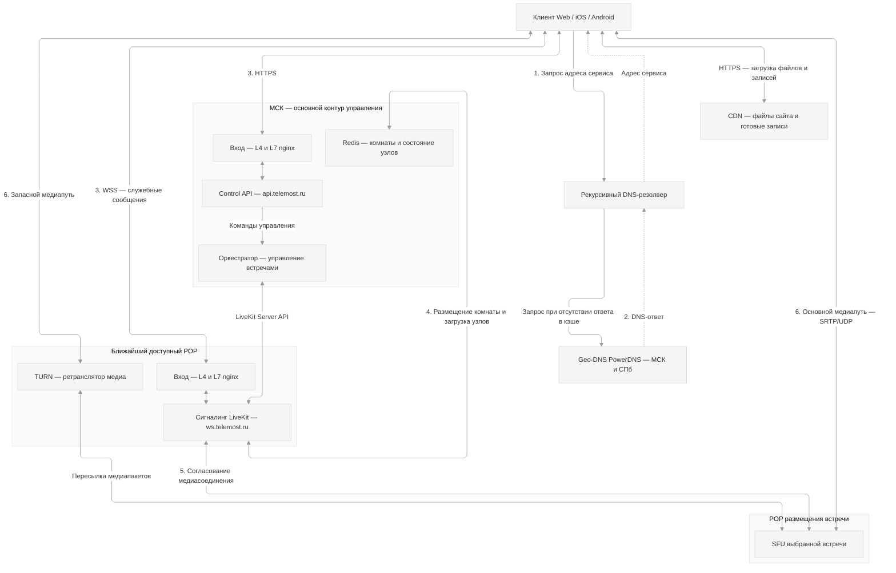

# Исходный код диаграммы: Схема DNS-балансировки (раздел 3)

```mermaid
%%{init: {
    "theme": "base",
    "layout": "elk",
    "look": "classic",
    "fontFamily": "Arial, sans-serif",
    "themeVariables": {
        "fontSize": "14px",
        "primaryColor": "#f5f5f5",
        "primaryTextColor": "#333333",
        "primaryBorderColor": "#dddddd",
        "lineColor": "#999999",
        "secondaryColor": "#f5f5f5",
        "tertiaryColor": "#fafafa",
        "clusterBkg": "#fafafa",
        "clusterBorder": "#e5e5e5",
        "edgeLabelBackground": "#ffffff"
    },
    "flowchart": {
        "curve": "linear",
        "look": "classic",
        "wrappingWidth": 200,
        "nodeSpacing": 55,
        "rankSpacing": 75,
        "padding": 18
    },
    "themeCSS": ".node rect { rx: 12px; ry: 12px; stroke-width: 1px; } .cluster rect { rx: 14px; ry: 14px; stroke-width: 1px; } .edgeLabel .labelBkg { background-color: #ffffff; border: 1px solid #e5e5e5; border-radius: 10px; padding: 3px 8px; } .edgeLabel .labelBkg:has(.edgeLabel:empty) { border: 0; padding: 0; } .edgeLabel p { margin: 0; } .flowchart-link { stroke-width: 1px; stroke-linecap: round; stroke-linejoin: round; }"
}}%%
flowchart TD
    U["Клиент Web / iOS / Android"]
    R["Рекурсивный DNS-резолвер"]
    G["Geo-DNS PowerDNS — МСК и СПб"]
    CDN["CDN — файлы сайта и готовые записи"]

    subgraph EDGE["Ближайший доступный POP"]
        VIP["Вход — L4 и L7 nginx"]
        SIG["Сигналинг LiveKit — ws.telemost.ru"]
        TURN["TURN — ретранслятор медиа"]
    end

    subgraph CONTROL["МСК — основной контур управления"]
        VIPM["Вход — L4 и L7 nginx"]
        API["Control API — api.telemost.ru"]
        O["Оркестратор — управление встречами"]
        RD["Redis — комнаты и состояние узлов"]
    end

    subgraph MEDIA["POP размещения встречи"]
        SFU["SFU выбранной встречи"]
    end

    U -->|"1. Запрос адреса сервиса"| R
    R -->|"Запрос при отсутствии ответа в кэше"| G
    G -.->|"2. DNS-ответ"| R
    R -.->|"Адрес сервиса"| U

    U <-->|"3. HTTPS"| VIPM
    VIPM <--> API

    U <-->|"3. WSS — служебные сообщения"| VIP
    VIP <--> SIG

    API -->|"Команды управления"| O
    O <-->|"LiveKit Server API"| SIG
    SIG <-->|"4. Размещение комнаты и загрузка узлов"| RD

    SIG <-->|"5. Согласование медиасоединения"| SFU

    U <-->|"6. Основной медиапуть — SRTP/UDP"| SFU
    U <-->|"6. Запасной медиапуть"| TURN
    TURN <-->|"Пересылка медиапакетов"| SFU

    U <-->|"HTTPS — загрузка файлов и записей"| CDN
```
