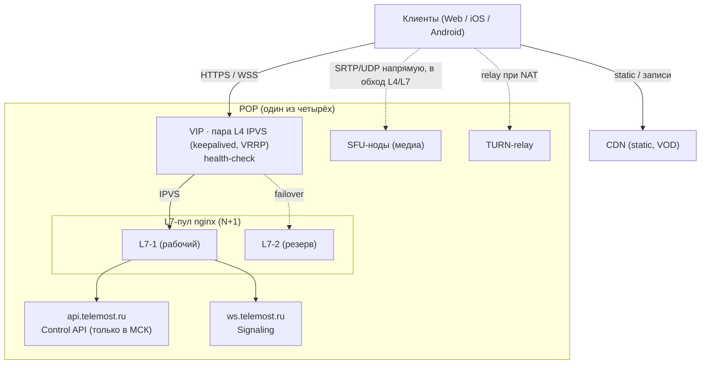

# Исходный код диаграммы: Схема локальной балансировки (раздел 4)

```mermaid
flowchart TD
    C["Клиенты (Web / iOS / Android)"]

    subgraph POP["POP (один из четырёх)"]
        VIP["VIP · пара L4 IPVS (keepalived, VRRP)<br/>health-check"]
        subgraph L7P["L7-пул nginx (N+1)"]
            L7A["L7-1 (рабочий)"]
            L7R["L7-2 (резерв)"]
        end
        API["api.telemost.ru<br/>Control API (только в МСК)"]
        WS["ws.telemost.ru<br/>Signaling"]
        SFU["SFU-ноды (медиа)"]
        TURN["TURN-relay"]
    end
    CDN["CDN (static, VOD)"]

    C -->|"HTTPS / WSS"| VIP
    VIP -->|"IPVS"| L7A
    VIP -. "failover" .-> L7R
    L7A --> API
    L7A --> WS
    C -. "SRTP/UDP напрямую, в обход L4/L7" .-> SFU
    C -. "relay при NAT" .-> TURN
    C -->|"static / записи"| CDN
```
