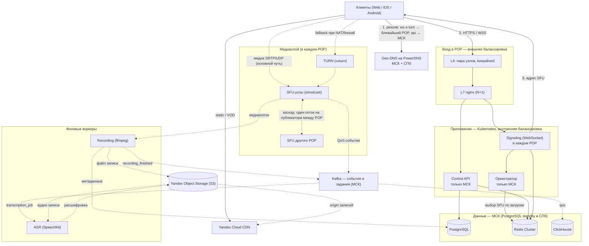

# Исходный код диаграммы: Схема проекта (раздел 10)

```mermaid
flowchart TD
    C["Клиенты (Web / iOS / Android)"]
    DNS["Geo-DNS на PowerDNS<br/>МСК + СПб"]

    subgraph EDGE["Вход в POP — внешняя балансировка"]
        L4["L4: пара узлов, keepalived"]
        L7["L7 nginx (N+1)"]
    end

    subgraph APP["Приложение — Kubernetes, внутренняя балансировка"]
        SIG["Signaling (WebSocket)<br/>в каждом POP"]
        API["Control API<br/>только МСК"]
        ORC["Оркестратор<br/>только МСК"]
    end

    subgraph MEDIA["Медиаслой (в каждом POP)"]
        SFU["SFU-узлы (simulcast)"]
        SFU2["SFU другого POP"]
        TURN["TURN (coturn)"]
    end

    subgraph WORK["Фоновые воркеры"]
        REC["Recording (ffmpeg)"]
        ASR["ASR (SpeechKit)"]
    end

    subgraph DATA["Данные — МСК (PostgreSQL standby в СПб)"]
        PG[("PostgreSQL")]
        RD[("Redis Cluster")]
        CH[("ClickHouse")]
    end
    OS[("Yandex Object Storage (S3)")]

    KAFKA["Kafka — события и задания (МСК)"]
    CDN["Yandex Cloud CDN"]

    C -->|"1. резолв: ws и turn → ближайший POP, api → МСК"| DNS
    C -->|"2. HTTPS / WSS"| L4
    L4 --> L7
    L7 --> API
    L7 --> SIG
    SIG --> ORC
    ORC -->|"выбор SFU по загрузке"| RD
    SIG -->|"3. адрес SFU"| C
    API --> PG
    API --> RD
    SIG --> RD

    C -.->|"медиа SRTP/UDP (основной путь)"| SFU
    C -.->|"fallback при NAT/firewall"| TURN
    TURN -.-> SFU
    SFU <-.->|"каскад: один поток на публикатора между POP"| SFU2

    SFU -.->|"медиапоток"| REC
    REC -.->|"файл записи"| OS
    REC -.->|"метаданные"| PG
    REC -.->|"recording_finished"| KAFKA
    KAFKA -.->|"transcription_job"| ASR
    OS -.->|"аудио записи"| ASR
    ASR -.->|"расшифровка"| OS

    SFU -.->|"QoS-события"| KAFKA
    KAFKA -.->|"qos"| CH

    C -->|"static / VOD"| CDN
    OS -.->|"origin записей"| CDN
```
